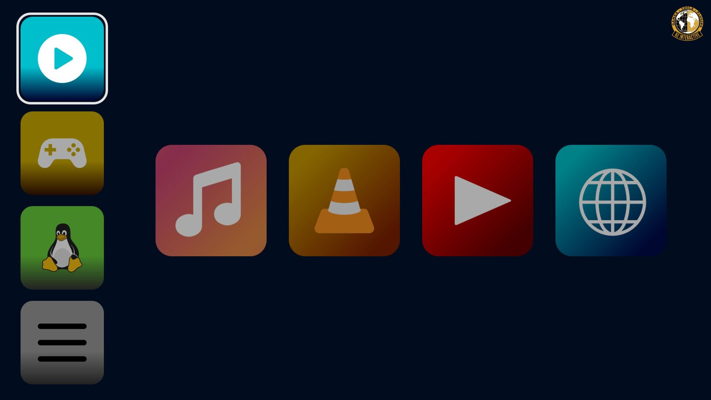
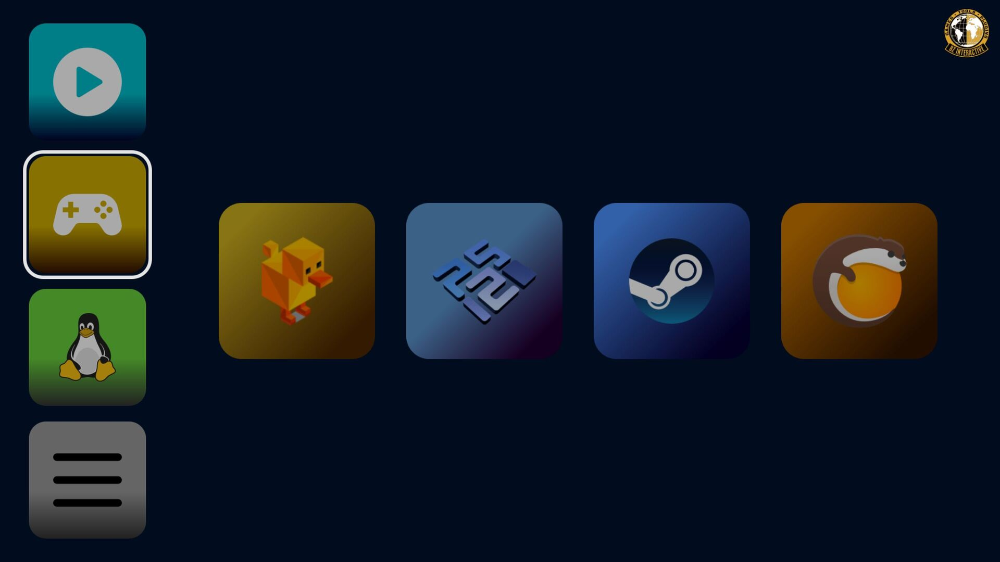
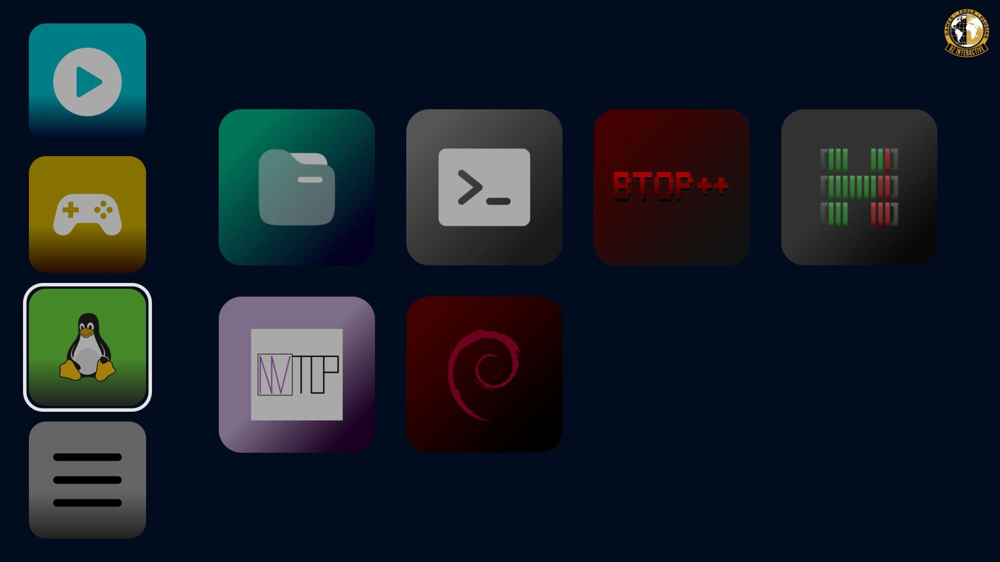
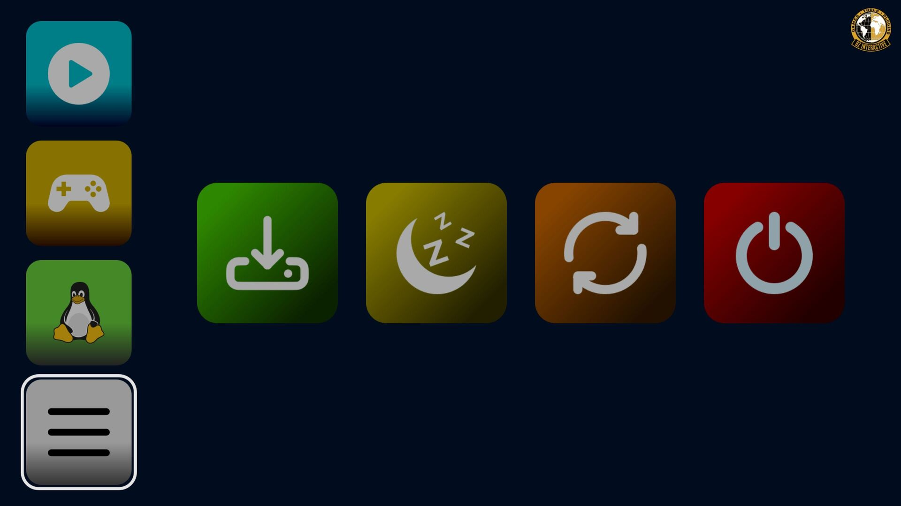
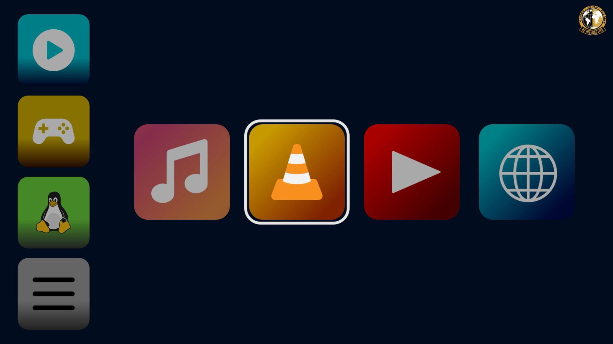
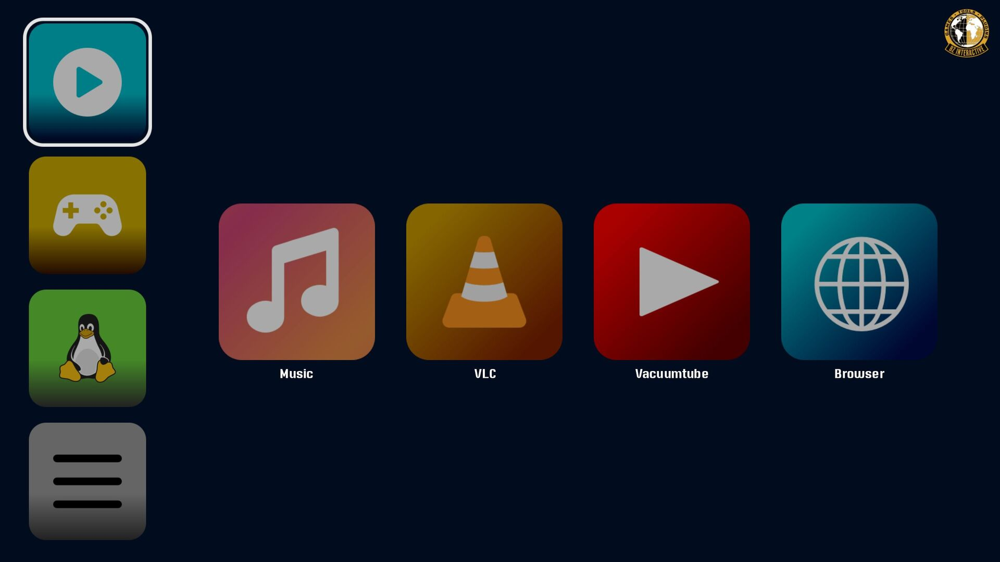

# BZ-Big-Picture

A game console-like GUI and shell launcher written in Godot. Big Picture provides a clean, tiled interface for launching your favorite applications, games, and system commands.

## Screenshots

| | | |
|---|---|---|
|  |  |  |
|  |  |  |

## Lightweight

- **CPU usage:** ~0.7% (per process)
- **RAM usage:** ~125 MB
- **Power draw:** ~2.2 W max
- **Tested on:** Intel i7-7700HQ

## Installation

Pre-compiled binaries are provided, so no system dependencies or package installation is required.

1. Download the tar.gz archive matching your architecture (e.g. `BZ-Big-Picture-v1.1.1-linux-x86_64.tar.gz` from the [Releases](https://github.com/BZ-0/BZ-Big-Picture/releases) page).
2. Extract the archive to your preferred location (your home directory is recommended).
   - The binary **must** remain in the same directory as `config.cfg` and the `Icons`, `Fonts` (and `Backgrounds` if used) folders, as it loads resources relative to its installation directory.
   - This directory structure is included in the tar.gz archive.
3. Run the executable (`BZ Big Picture.x86_64`). If your system flags it as untrusted, allow/trust the file to run.
4. *(Optional, recommended)* Add it to your autostart or a startup script for convenience. 

   **Example (Openbox on Debian):**
   ```bash
   ~/BZ-Big-Picture-v1.1.1-linux-x86_64/"BZ Big Picture.x86_64" &
   ```

## Configuring the Launcher

### `config.cfg`

The provided `config.cfg` is already populated with example entries. Every main value has a default, so omitting an entry will not break the launcher. 

> Note: Godot's config parsing requires `entry=value` syntax. Empty values will break parsing — `value=""` is accepted, but `value=` is not.

#### Main variables

| Variable | Description |
| --- | --- |
| `active_fps` | FPS target when the window is in focus. |
| `background_fps` | FPS target when the window is out of focus (recommended to keep low). |
| `vsync_mode` | VSync mode: `0` = off, `1` = enabled. Other modes are available but not recommended. |
| `display_names` | `true`/`false` — display app names under their buttons. |
| `font` | Font filename to load from the `Fonts/` directory. |
| `media_disabled` | `true`/`false` — disable the Media category. |
| `games_disabled` | `true`/`false` — disable the Games category. |
| `utilities_disabled` | `true`/`false` — disable the Utilities category. |
| `brightness` | Screen brightness where `1.0` = 100%. Values below `0.1` are clamped to `0.1`. |
| `idle_time` | Time in seconds before the launcher dims the screen due to inactivity (default: `300` = 5 minutes). |

#### Creating entries

There are 4 categories: `media`, `games`, `utilities`, and `system`. You can add any number of entries, but **12 or fewer per category is recommended**.

Entries follow this syntax:

```ini
[media.web]
name="Browser"
icon="web.svg"
command="chromium"
```

| Key | Description |
| --- | --- |
| `[category.id]` | Category (`media`, `games`, `utilities`, `system`) and a unique ID for this entry. |
| `name` | Display name shown in the UI (only visible if `display_names` is `true`). |
| `icon` | Icon filename to load from the `Icons/` directory (e.g. `web.svg`, `music.svg`). |
| `command` | Command to execute when the button is pressed. You can use full paths, shell scripts, or any valid shell command (see the provided `config.cfg` for examples). |

## Adding Assets (Icons, Fonts & Videos)

### Icons
Add icon files to the `Icons/` folder next to the binary. Supported formats: `svg`, `png`, `jpg`, `jpeg`. Reference them by filename in your `config.cfg` entries (e.g. `icon="steam.svg"`).

### Fonts
Add font files to the `Fonts/` folder next to the binary. The `font` option in `config.cfg` accepts any font format supported by Godot (e.g. `.ttf`, `.otf`, etc.). Simply set `font="FontName.otf"` (or the full filename).

### Videos
Video support is currently **work-in-progress (WIP)** and not fully functional yet.


## Custom Godot Build

This project uses a custom built Godot 4.7.2. To build from source, use [SCons](https://scons.org/).

### `custom.py`

Use the following SCons custom options when building (replace with your provided values):

```python
extra_suffix = "bzbigpicture"
disable_path_overrides = "no"
accesskit = "no"
production = "yes"
disable_3d = "yes"
optimize = "size"
precision = "single"
disable_advanced_gui = "yes"
deprecated = "no"
minizip = "no"
brotli = "no"
d3d12 = "no"
module_basis_universal_enabled = "no"
module_bmp_enabled = "no"
module_camera_enabled = "no"
module_csg_enabled = "no"
module_dds_enabled = "no"
module_enet_enabled = "no"
module_fbx_enabled = "no"
module_gltf_enabled = "no"
module_gridmap_enabled = "no"
module_hdr_enabled = "no"
module_interactive_music_enabled = "no"
module_jsonrpc_enabled = "no"
module_ktx_enabled = "no"
module_meshoptimizer_enabled = "no"
module_mobile_vr_enabled = "no"
module_msdfgen_enabled = "no"
module_multiplayer_enabled = "no"
module_navigation_2d_enabled = "no"
module_navigation_3d_enabled = "no"
module_noise_enabled = "no"
module_openxr_enabled = "no"
module_raycast_enabled = "no"
module_regex_enabled = "no"
module_squish_enabled = "no"
module_text_server_adv_enabled = "no"
module_tga_enabled = "no"
module_upnp_enabled = "no"
module_vhacd_enabled = "no"
module_webrtc_enabled = "no"
module_websocket_enabled = "no"
module_webxr_enabled = "no"
module_zip_enabled = "no"
disable_physics_2d = "yes"
disable_physics_3d = "yes"
vulkan = "no"
use_volk = "no"
openxr = "no"
threads="yes"
deprecated="no"
module_visual_shader_enabled = "no"

# Enabled ones
module_freetype_enabled = "yes"
module_mbedtls_enabled = "yes"
module_svg_enabled="yes"
module_text_server_fb_enabled = "yes"
```
